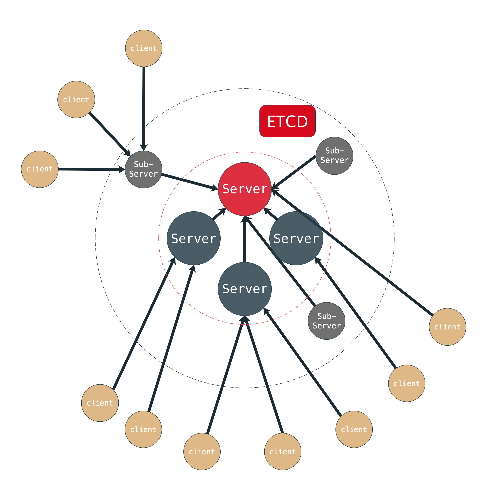

# webds
Distributed System with websocket

## 设计

- 整体结构

    Server层为核心服务层，通过选举产生一个中心节点.
    SubServer层实例不可被选举为中心节点，但可以跨网段部署，其余与server节点等效
    client层节点可以连接任意server节点
    每个server节点都有维护 superior/lateral master 列表, 用以记录上级和平级的节点.
    每个节点最多只有一个实际往出连通的平级或上级的连接,用以维护数据广播的最终一致性
    平级连接之间共享 superior/lateral master 列表
    出口连接共享 topics 1级订阅列表
    出口连接当成一个特殊的入口连接, 出口连接不存在则为整个广播系统最核心的master节点,出口连接断掉则根据选举算法重新确定连接

- 通信方式

        websocket

- 通信协议

        主要以多级topic设计消息目标地址, 父子topic订阅节点会递归触发 其余参考ip层设计协议
        参考iris  序列化成字节流，格式: prefix(n)type(1)random_tag(4)source_idx(4)target_topic;msg
        type: 1个字节 msg type
        random_tag: 5个byte
        source_idx: 四个字节长度的数字 利用源地址映射 避免该地址长度线性增长 
        target_topic: 目标topic
        msg: json or protobuf
        保留下列1级topic，其余topic用于分发
            /sys   用于系统指令, 消息不广播, 用以两个节点之间连接维护状态和共享信息
            /inner 用于client 连接的Server直接处理，不进行广播, 响应函数由 conn.On 函数指定
            /self  用于回复消息时使用, 回复消息统一目标地址为/self/source_idx
                   source_idx 定长 4个字节, 根据source_idx 映射表找到实际的上一跳地址
            /srv   用以注册同步类型服务 暂未开发

- 命令行工具设计

        参照ros命令行设计：形如
            - webds topic list/pub/sub
            - webds node list/stop

- 选举步骤
    - 交换id
    - 交换信息
    - 请求是否跳转 不跳转则建立成功
        
## TODO

- client/go/py/js

- command tools

- 分布式，选举产生中心通信节点

- 服务模式(同步消息机制)

- 消息广播机制 优化和benchmark

## update

- v0.2.4 同级节点选举过程完成
- v0.2.3 修改了消息协议 完善分布式设计思路
- v0.2.2 修改了OnConnection的回调函数, 若回调函数返回error, 则 conn 直接关闭, 该功能可用于鉴定权限. 优化消息解析代码. 初步开始设计分布式结构.
- v0.2.1 添加webds node list/stop 指令
- v0.2.0 基于topic订阅机制初步重构完 server， go.client，command tool
- v0.1.0 old version just a websocket server
